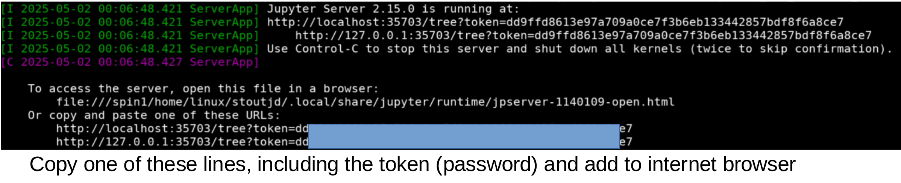
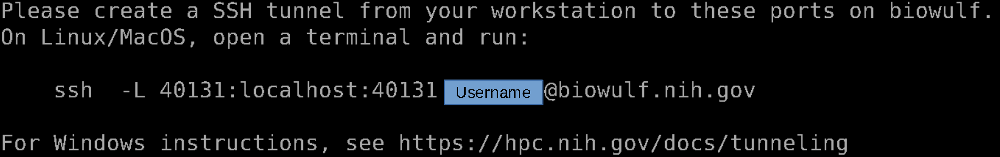
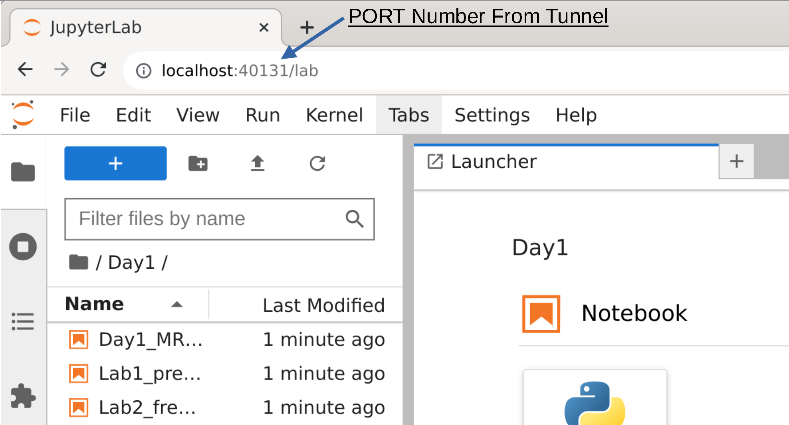

# NIH_MEG_Workshop_AdvancedTopics

[Calendar](#Calendar) <br>
[Biowulf Setup](#BiowulfInfo) <br>
[Install](#Install) <br>


<a id="Calendar"></a>
## Day 1 (05/02/2025)  - FAES ROOM 6 – B1C208
### Connectivity and Decoding
| Time  | Topic | Presenter |
| :---- | ---- | ---- |
| 9:00 - 9:15 | Computer Setup etc |
| 9:15 - 9:30 | Course Intro + Souce Localization (for connectivity) | Jeff |
| 9:30 - 10:30 | Connectivity Background | Lucrezia |
| 10:30 - 11:30 | Connectivity Code | |
| 11:30 - 12:30 | Lunch  
| 12:30 - 1:30  |  Decoding Background  |  Lina | 
| 1:45 - 2:30   |  Decoding Applications  |  Shruti, Alexis, Sebastian | 
| 2:30 - 4:00   |  Decoding Code  |  | 


<a id="BiowulfInfo"></a>
# Computer Setup Using NoMachine
Once in NoMachine on Biowulf, copy the following lines into your terminal.
Start a processing terminal 
```
sinteractive --mem=32G --cpus-per-task=12 --tunnel  #Wait for this to start
```

```
module use --append /data/MEGmodules/modulefiles  #You can add this to your .bashrc for convenience
module load meg_workshop/2025adv.1
```
```
get_code   #Copy the code to your current directory
get_data   #Copy and untar the data to your /data/${USER}/meg_data_workshop
```
```
cd /data/${USER}/NIH_MEG_Workshop_AdvancedTopics
jupyter notebook --no-browser --port $PORT1
```
Once the prompts come up, you will see a line like the following:


Open an Internet Browser in the top left corner and add the IP address and token into the address bar

<a id="BiowulfInfoV2"></a>
# Alternative version using SSH Tunnels (This is more difficult to setup, but faster to use)
Log into biowulf:  `ssh -Y USERNAME@biowulf.nih.gov`
```
#You can type tmux before starting sinteractive to have a persistent session between disconnecting wifi
#Allocate resources for processing
sinteractive --mem=32G --cpus-per-task=12 --gres=lscratch:10 --tunnel --time=08:00:00
```
You will see a line like the below. Follow the instructions (start a new terminal into biowulf), then return to original terminal for the rest of the commands.


Copy the following lines into your terminal.
This will copy the code/notebooks and data into your local folder.  
```
sinteractive --mem=32G --cpus-per-task=12 --tunnel  #Wait for this to start
```

```
module use --append /data/MEGmodules/modulefiles  #You can add this to your .bashrc for convenience
module load meg_workshop/2025adv.1
```
```
get_code   #Copy the code to your current directory
get_data   #Copy and untar the data to your /data/${USER}/meg_data_workshop
```
```
cd /data/${USER}/NIH_MEG_Workshop_AdvancedTopics
jupyter notebook --no-browser --port $PORT1
```


Enter this into the address bar of your web browser `localhost:<PORT>` <br>


**NOTE**:If you get something about a **token**: Copy it from the commandline<br><br>


<a id="Install"></a>
# Optional: Install Code (on your own system)
Install using make: <br>
`make install_env`
<br>
Install from conda environment.yml file:<br>
`conda env create --name envname --file=environments.yml`


